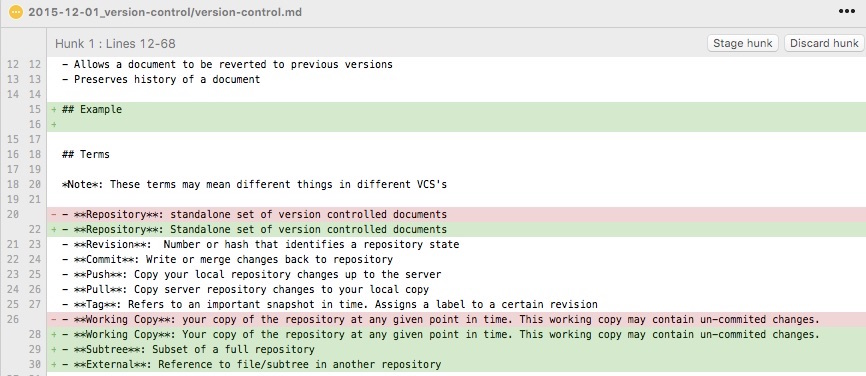
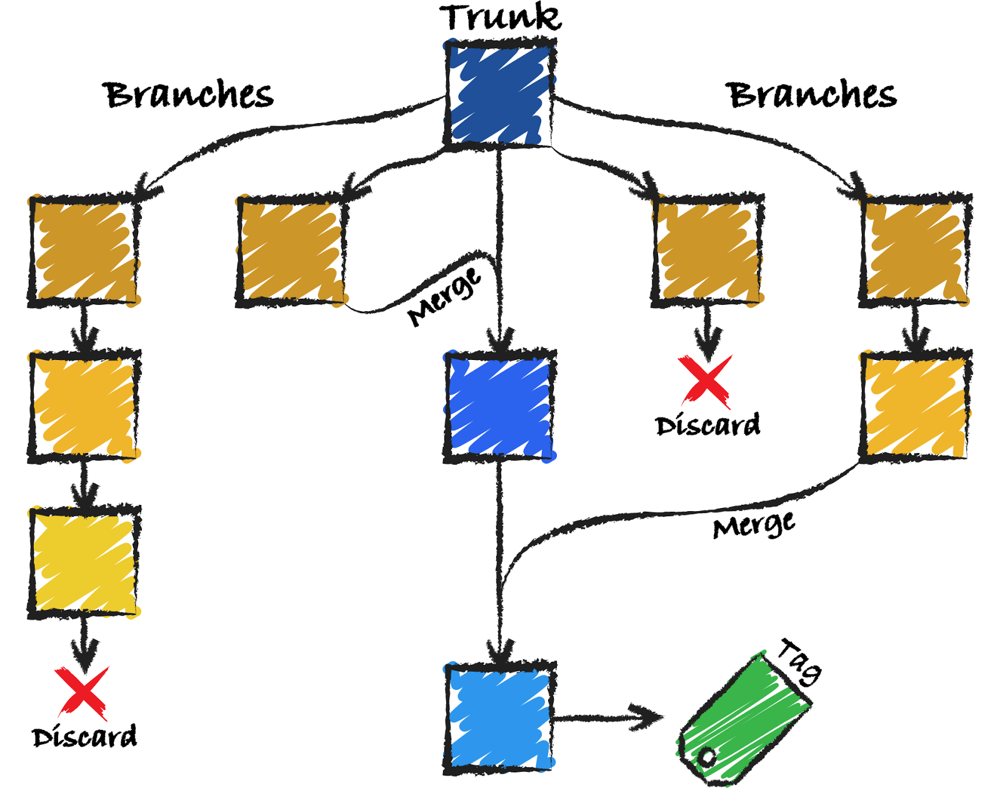

# Version Control

December 1 2015

## What is Version Control?

A.K.A: *Revision Control*, *Source Control*

**The management of changes to documents**

- *Track Changes* across document edits
- Allows a document to be reverted to previous versions
- Preserves history of a document

## Example Diff

Below you can see the **diff** between this file in a previous **commit** and my current **working copy**



In my **working copy**, i've removed lines (in red) and added lines (in green)


## Example Workflow




## VCS Programs

**Git** and **SVN** are the two VCS programs we use here

Both programs come with a full set of command line tools, though there are many tools to provide a GUI for them

---

#### SVN (Subversion)

Open source VCS maintained by Apache

- [Source](https://subversion.apache.org/)
- Windows GUI: [Tortoise SVN](http://tortoisesvn.net/)
- Mac GUI: [Versions](http://versionsapp.com/)

**Pros**: 

- Simple, stable, mature software
- Easy to teach and implement for small to large projects
- Fairly linear workflow.

**Cons**: 

- Not well suited for intricate branching, merging 
- Harder to handle larger projets with many developers
- Slower, larger repositories

---

#### Git

Open source VCS written by Linus Torvalds (creator of Linux)

- [Source](https://git-scm.com/)
- Cross Platform GUI: [Source Tree](https://www.sourcetreeapp.com/)

**Pros**: 

- Emphasis on distributed, non-linear workflows
- Faster than SVN
- "Allows for *frictionless context switching*, *disposable experimentation*, and *feature based workflow*"

**Cons**: 

- Much more complicated to learn
- You can't check out partial repositories (i.e *subtrees*)

## Workflow Differences

Differences in workflow between SVN and GIt

#### SVN


---

#### Git

Adds an extra layer between your working copy and the repository


## Ignoring Files

Sometimes you don't want files to be committed to the repository

#### Git

You can place a file named `.gitignore` at any level of a git directory and it can contain file globbing patterns to ignore certain paths

```bash
# all files with extension
*.html

# directories
platforms/
```

---

#### SVN

Its slightly more complicated to ignore files in SVN, unless you use Tortoise. 

To ignore from the command line, use the following command in your repository:

```bash
$ svn propset svn:ignore "*.jpg" . 
```

## Terms

Glossary of terms to help translate between git and svn

#### General

- **Repository**: Standalone set of version controlled documents
- **Revision**:  Number or hash that identifies a repository state
- **Diff**: The difference between one copy of a file and another
- **Working Copy**: Your copy of the repository at any given point in time. This working copy may contain un-commited changes.
- **Subtree (git)**: Subset of a full repository
- **External (svn)**: Reference to file/subtree in another repository

---

#### Actions

- **Clone (git) / Checkout (svn)**: Download a repository to your local machine
- **Commit**: Write or merge changes back to repository
- **Push (git)**: Copy your local repository changes up to the server
- **Pull (git) / Update (svn)**: Copy server repository changes to your local copy
- **Tag**: Refers to an important snapshot in time. Assigns a label to a certain revision


## Pitfalls

**General**

- Be very careful when you *move* documents

**Git**

- Git only tracks changes to *files*, not *directories*
- Sometimes you want to un-ignore a file. You may have to manually add the file with the force flag: `git add -f file.html`

**SVN**


## Try it out

Use a sandbox to explore **git** and **svn**

#### Git

- **Clone (checkout)** the [sandbox](https://github.com/mlshapiro/git-sandbox.git)
- **Commit** a change to your local repository
- **Branch** your local repository
	- **Commit** multiple changes to your branch
-  **Branch** your local repository again
	- **Commit** a change to this branch  
- **Merge** both branches back into the `master`
- **Push** your master branch back up to the server repository

